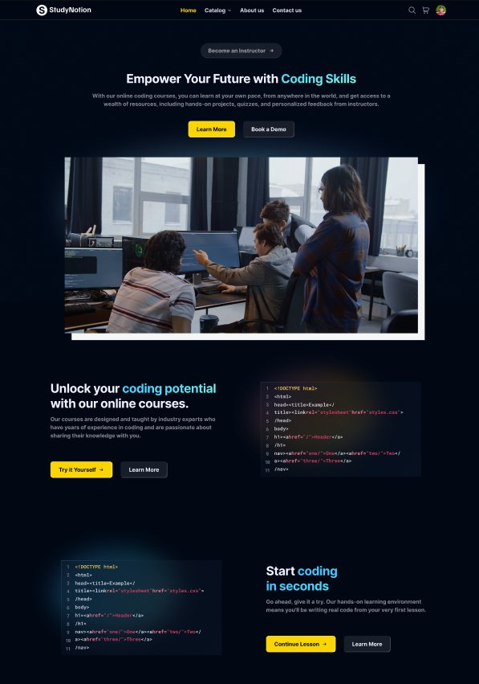
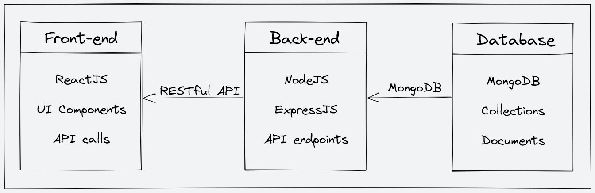
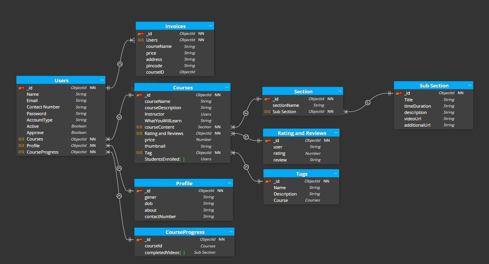

<div align="center">


# 📚 StudyNotion — EdTech Learning Platform

**An end-to-end full-stack EdTech platform built with the MERN stack, where students learn, instructors teach, and knowledge scales.**

[](https://reactjs.org/)
[](https://nodejs.org/)
[](https://www.mongodb.com/)
[](https://redux-toolkit.js.org/)
[](https://tailwindcss.com/)
[](https://razorpay.com/)

</div>


---

## 🚀 Quick Start — Clone & Setup

### Prerequisites

Make sure you have the following installed before you begin:

- [Node.js](https://nodejs.org/) v16 or above (check with `node -v`)
- [npm](https://www.npmjs.com/) v8 or above
- [Git](https://git-scm.com/)
- A [MongoDB Atlas](https://www.mongodb.com/atlas) account (free tier works)
- A [Cloudinary](https://cloudinary.com/) account (for media uploads)
- A [Razorpay](https://razorpay.com/) account (for payment integration)

---

### 1. Clone the Repository

```bash
git clone https://github.com/mulikshivam02/StudyNotion.git
cd StudyNotion-EdTech
```

---

### 2. Install Frontend Dependencies

From the **root** of the project:

```bash
npm install
```

---

### 3. Install Backend Dependencies

```bash
cd server
npm install
cd ..
```

---

### 4. Configure Environment Variables

#### Backend `.env` — create `server/.env`:

```env
# MongoDB
MONGODB_URL=your_mongodb_atlas_connection_string

# JWT
JWT_SECRET=your_jwt_secret_key

# Cloudinary
CLOUD_NAME=your_cloudinary_cloud_name
API_KEY=your_cloudinary_api_key
API_SECRET=your_cloudinary_api_secret
FOLDER_NAME=StudyNotion

# Razorpay
RAZORPAY_KEY=your_razorpay_key_id
RAZORPAY_SECRET=your_razorpay_secret

# Nodemailer / Mail
MAIL_HOST=smtp.gmail.com
MAIL_USER=your_email@gmail.com
MAIL_PASS=your_gmail_app_password

# Server
PORT=4000
```

#### Frontend `.env` — create `.env` in the root:

```env
REACT_APP_BASE_URL=http://localhost:4000/api/v1
```

---

### 5. Run the Application

**Option A — Run both together (recommended):**

```bash
npm run dev
```

This starts the React frontend (`localhost:3000`) and the Express backend (`localhost:4000`) concurrently.

**Option B — Run separately:**

```bash
# Terminal 1 — Backend
cd server
npm run dev

# Terminal 2 — Frontend
npm start
```

---

### 6. Open in Browser

```
Frontend: http://localhost:3000
Backend API: http://localhost:4000/api/v1
```

---

## 📖 Project Overview

**StudyNotion** is a feature-rich, fully responsive EdTech web platform that brings together students, instructors, and administrators on a single unified system. The platform enables instructors to create and manage courses with rich multimedia content, while students can browse, purchase, and consume that content at their own pace — all backed by a secure payment gateway, real-time progress tracking, OTP-based email verification, and cloud-hosted media.

This project demonstrates a complete production-grade MERN stack architecture — from JWT-based authentication and role-based access control, to Cloudinary media pipelines, Razorpay payment webhooks, and a fully componentised React frontend powered by Redux Toolkit.

---

## 🏗️ System Architecture

<div align="center">
  
  <p><em>Three-tier architecture: React frontend communicates with the Express/Node.js backend via RESTful APIs, and the backend persists data to MongoDB Atlas.</em></p>
</div>

The application follows a clean three-tier separation:

- **Frontend** (React + Redux) — Handles UI rendering, client-side routing, and API calls via Axios. Redux Toolkit manages global state for authentication, cart, course progress, and user profiles.
- **Backend** (Node.js + Express.js) — Exposes RESTful API endpoints. Handles business logic, JWT middleware for protected routes, role-based guards (`isStudent`, `isInstructor`, `isAdmin`), and integrates with all third-party services.
- **Database** (MongoDB + Mongoose) — Stores all persistent data: users, courses, sections, subsections, ratings, progress, and invoices.

---

## 🗄️ Database Schema

<div align="center">
  
  <p><em>Entity-relationship diagram showing all MongoDB collections and their references.</em></p>
</div>

The database is composed of the following collections:

| Collection | Description |
|---|---|
| **Users** | Stores all user accounts (students, instructors, admins) with account type and approval status |
| **Profile** | Extended profile data (gender, DOB, bio, contact number) linked to a User |
| **Courses** | Course metadata — name, description, price, thumbnail, instructor reference, enrolled students |
| **Section** | Top-level sections within a course (e.g., "Module 1: Intro") |
| **SubSection** | Individual lessons/videos within a section, including video URL and duration |
| **CourseProgress** | Tracks which subsections a student has completed per course |
| **RatingAndReviews** | Student ratings and text reviews linked to a course |
| **Category** | Course tags/categories for filtering and catalog browsing |
| **Invoices** | Purchase records tied to user and course |
| **OTP** | Temporary OTP records with TTL expiration for email verification |

---

## 🛠️ Tech Stack

### Frontend
| Technology | Purpose |
|---|---|
| React 18 | Component-based UI framework |
| React Router v6 | Client-side routing and nested routes |
| Redux Toolkit | Global state management |
| Axios | HTTP client for API calls |
| Tailwind CSS | Utility-first responsive styling |
| React Hook Form | Performant form handling and validation |
| React Hot Toast | Notification toasts |
| Swiper.js | Carousel/slider components |
| Video React | In-browser video playback |
| Chart.js + react-chartjs-2 | Analytics charts for instructor dashboard |
| React Type Animation | Animated typewriter text effects |
| React Dropzone | Drag-and-drop file uploads |

### Backend
| Technology | Purpose |
|---|---|
| Node.js + Express.js | Server runtime and web framework |
| Mongoose | MongoDB ODM for schema modeling |
| JSON Web Tokens (JWT) | Stateless authentication |
| Bcrypt | Password hashing |
| Nodemailer | Transactional email delivery |
| OTP Generator | One-time password generation |
| Razorpay SDK | Payment processing and webhooks |
| Cloudinary SDK | Cloud image and video storage |
| Express File Upload | Multipart file handling |
| Cookie Parser | Cookie management for JWT tokens |
| Dotenv | Environment variable management |
| Nodemon | Auto-restart during development |

---

## ✨ Features & Functionality

### 🔐 Authentication & Security
- OTP-based email verification on signup — users cannot access the platform until their email is confirmed
- JWT-based stateless authentication stored in secure HTTP cookies
- Forgot password flow with time-limited reset tokens sent via email
- Password update with current password confirmation
- Role-based access control: `Student`, `Instructor`, and `Admin` roles with distinct permissions enforced on both frontend routes and backend middleware

---

### 👩‍🎓 Student Features

| Feature | Description |
|---|---|
| **Browse Catalog** | Explore courses by category, with course cards showing ratings, price, and instructor |
| **Course Detail Page** | View full course syllabus, what you'll learn, requirements, instructor bio, and student reviews before purchasing |
| **Cart & Checkout** | Add courses to cart, review total, and complete purchase via Razorpay payment gateway |
| **Payment Confirmation Email** | Receive an automated email receipt upon successful enrollment |
| **My Enrolled Courses** | Dashboard view showing all purchased courses with progress indicators |
| **Video Lectures** | Watch course videos with a sidebar showing completed and remaining subsections |
| **Progress Tracking** | Mark lessons as complete; progress is tracked per-subsection and visualised as a percentage |
| **Rate & Review** | Submit ratings (1–5 stars) and written reviews after enrolling in a course |
| **Profile Management** | Update display name, gender, date of birth, about section, contact number, and profile picture |
| **Change Password** | Update account password from the settings panel |
| **Account Deletion** | Permanently delete account and associated data |

---

### 👨‍🏫 Instructor Features

| Feature | Description |
|---|---|
| **Instructor Dashboard** | Overview of total courses, total students enrolled, and total revenue with interactive charts |
| **Earnings Chart** | Visualise revenue per course using a Bar or Pie chart (Chart.js) |
| **Create Course** | Multi-step course creation wizard: fill course information → build content structure → publish |
| **Course Information Form** | Set title, description, price, category, tags, thumbnail image, and learning objectives |
| **Course Builder** | Add sections and nested subsections (video lectures) with drag-like nested management UI |
| **Video Upload** | Upload lecture videos directly to Cloudinary via the platform; add title, description, and additional URLs |
| **Edit Course** | Modify any course detail, section, or subsection at any time |
| **Delete Course / Section / SubSection** | Clean up content with confirmation modals |
| **My Courses Table** | Tabular view of all created courses with enrolment count, price, and quick action buttons |
| **Profile Settings** | Manage personal profile and account settings |

---

### 🛡️ Admin Features

| Feature | Description |
|---|---|
| **Create Categories** | Add new course categories/tags that instructors use when creating courses |
| **Manage Categories** | Full category lifecycle management with admin-only middleware guards |

---

### 🌐 General / Public Features

| Feature | Description |
|---|---|
| **Home Page** | Animated hero section, explore courses, instructor CTA, and review slider |
| **Catalog Pages** | Category-filtered course browsing with top-rated and featured course sections |
| **About Page** | Platform story, stats (students, mentors, courses, awards), and learning grid |
| **Contact Us Page** | Contact form with email delivery, phone and address details |
| **Responsive UI** | Fully responsive layout across desktop, tablet, and mobile breakpoints |
| **Email Templates** | Styled HTML email templates for OTP verification, enrollment confirmation, payment receipts, and password updates |

---

## 📂 Project Structure

```
StudyNotion-EdTech/
├── public/                        # Static public assets
├── src/                           # React frontend source
│   ├── assets/                    # Images, logos, videos
│   ├── components/
│   │   ├── Common/                # Navbar, Footer, Modals, Rating stars
│   │   └── core/
│   │       ├── Auth/              # Login, Signup, PrivateRoute, OTP
│   │       ├── Dashboard/         # All dashboard panels (student + instructor)
│   │       │   ├── AddCourse/     # Multi-step course creation wizard
│   │       │   ├── Cart/          # Cart management
│   │       │   ├── Settings/      # Profile, password, account deletion
│   │       │   └── InstructorDashboard/  # Charts and analytics
│   │       ├── Course/            # Course detail page components
│   │       ├── Catalog/           # Course cards and sliders
│   │       ├── ViewCourse/        # Video player and sidebar
│   │       ├── HomePage/          # Hero, CodeBlocks, Timeline sections
│   │       └── AboutPage/         # Stats, learning grid, contact form
│   ├── pages/                     # Top-level route pages
│   ├── services/
│   │   ├── apis.js                # Centralised API endpoint constants
│   │   ├── apiConnector.js        # Axios wrapper
│   │   └── operations/            # Thunks: auth, course, profile, payments
│   ├── slices/                    # Redux Toolkit slices
│   ├── hooks/                     # Custom React hooks
│   ├── utils/                     # Helpers (date formatting, rating calc)
│   └── reducer/                   # Root Redux reducer
│
└── server/                        # Express backend
    ├── config/                    # DB, Cloudinary, Razorpay init
    ├── controllers/               # Business logic handlers
    │   ├── Auth.js                # Signup, login, OTP, password
    │   ├── Course.js              # CRUD for courses
    │   ├── Section.js             # Section management
    │   ├── Subsection.js          # Subsection & video management
    │   ├── Profile.js             # User profile operations
    │   ├── payments.js            # Razorpay order + verification
    │   ├── RatingandReview.js     # Review creation & retrieval
    │   ├── courseProgress.js      # Progress tracking
    │   ├── Category.js            # Category management
    │   └── ContactUs.js           # Contact form handler
    ├── middleware/
    │   └── auth.js                # JWT verify + role guards
    ├── models/                    # Mongoose schemas
    ├── routes/                    # Express route declarations
    ├── utils/                     # Image uploader, mail sender, helpers
    ├── mail/templates/            # HTML email templates
    └── index.js                   # Server entry point
```

---

## 🔌 API Endpoints Summary

| Route Prefix | Controller Area |
|---|---|
| `POST /api/v1/auth/signup` | User registration with OTP |
| `POST /api/v1/auth/login` | JWT-based login |
| `POST /api/v1/auth/sendotp` | Send OTP to email |
| `POST /api/v1/auth/changepassword` | Change password (auth required) |
| `POST /api/v1/auth/reset-password-token` | Generate reset token |
| `POST /api/v1/auth/reset-password` | Apply new password |
| `POST /api/v1/course/createCourse` | Create course (instructor only) |
| `POST /api/v1/course/editCourse` | Edit course (instructor only) |
| `POST /api/v1/course/addSection` | Add section (instructor only) |
| `POST /api/v1/course/addSubSection` | Add subsection + video upload |
| `GET /api/v1/course/getAllCourses` | Public course listing |
| `POST /api/v1/course/getCourseDetails` | Full course detail |
| `POST /api/v1/course/updateCourseProgress` | Mark lesson complete (student) |
| `POST /api/v1/course/createRating` | Submit review (student) |
| `GET /api/v1/course/getReviews` | Fetch all ratings |
| `POST /api/v1/payment/capturePayment` | Initiate Razorpay order |
| `POST /api/v1/payment/verifyPayment` | Verify and enroll student |
| `GET /api/v1/profile/getUserDetails` | Fetch user profile |
| `PUT /api/v1/profile/updateProfile` | Update profile info |
| `GET /api/v1/profile/getEnrolledCourses` | Student enrolled courses |
| `GET /api/v1/profile/instructorDashboard` | Instructor revenue/enrolment stats |
| `POST /api/v1/reach/contact` | Contact form submission |

---

## 🔮 Future Improvements

The following enhancements are planned for future versions of StudyNotion, prioritised by impact:

### 🔴 High Priority

**Personalised Learning Paths**
Creating individualised learning journeys for each student based on their interests, skill level, and learning style. The system would analyse course completion patterns and recommend a tailored sequence of courses and modules to maximise student success and retention.

**Mobile Application**
Developing a native mobile app (React Native) for iOS and Android to bring the full platform experience to smartphones. Mobile access would allow students to download lessons for offline viewing, receive push notifications, and learn on the go — significantly expanding the platform's reach.

### 🟡 Medium Priority

**Gamification Features**
Introducing badges, XP points, leaderboards, and course completion streaks to increase learner engagement and motivation. Gamification elements have been shown to meaningfully improve course completion rates in online learning environments.

**Social Learning Features**
Adding collaborative tools such as course-specific discussion forums, peer-to-peer assignment reviews, group projects, and live study sessions. Social interaction within the learning context improves engagement, accountability, and real-world skill development.

**Machine Learning–Powered Recommendations**
Implementing an ML recommendation engine that analyses a student's browsing history, completed courses, ratings, and peer behaviour to surface highly relevant course suggestions. This would improve discoverability and increase enrolment conversion rates.

### 🟢 Additional Enhancements

- **Live Classes** — Integrating WebRTC or Zoom SDK to support live instructor-led sessions and Q&A
- **Quizzes & Assignments** — Adding in-course assessments with automated grading and instructor feedback
- **Certificate Generation** — Issuing downloadable, verifiable PDF completion certificates upon course finish
- **Multilingual Support** — Localisation and i18n support to reach a global student audience
- **Dark / Light Mode** — User-toggleable theme preference
- **Admin Analytics Dashboard** — Platform-wide analytics for total revenue, active users, top courses, and growth trends

---

## 🤝 Contributing

Pull requests are welcome! For major changes, please open an issue first to discuss what you'd like to change.

1. Fork the repo
2. Create your feature branch: `git checkout -b feature/my-feature`
3. Commit your changes: `git commit -m "Add my feature"`
4. Push to the branch: `git push origin feature/my-feature`
5. Open a Pull Request

---

## 📄 License

This project is licensed under the [ISC License](https://opensource.org/licenses/ISC).

---

## ✅ Conclusion

StudyNotion is a comprehensive, production-ready EdTech platform that demonstrates the full breadth of the MERN stack — from database modelling and REST API design, to JWT authentication, third-party service integration, and a polished React frontend. The three-role system (student, instructor, admin) creates a complete ecosystem where educators can monetise their knowledge and learners can invest in their skills, all on one seamless platform.

The architecture is intentionally scalable: the decoupled frontend/backend design, cloud-hosted media pipeline (Cloudinary), and payment abstraction (Razorpay) make it straightforward to extend with new features, integrate additional services, or migrate individual layers without affecting the rest of the system. The roadmap items — personalised learning paths, ML recommendations, gamification, and a mobile app — represent a natural evolution path toward a best-in-class learning platform.

---

<div align="center">

Built with ❤️ using the MERN Stack

**[Report a Bug](https://github.com/your-username/StudyNotion-EdTech/issues)** · **[Request a Feature](https://github.com/your-username/StudyNotion-EdTech/issues)**

</div>
>>>>>>> da938efdd000503d0d8e258590dff85d62d3fe1d
